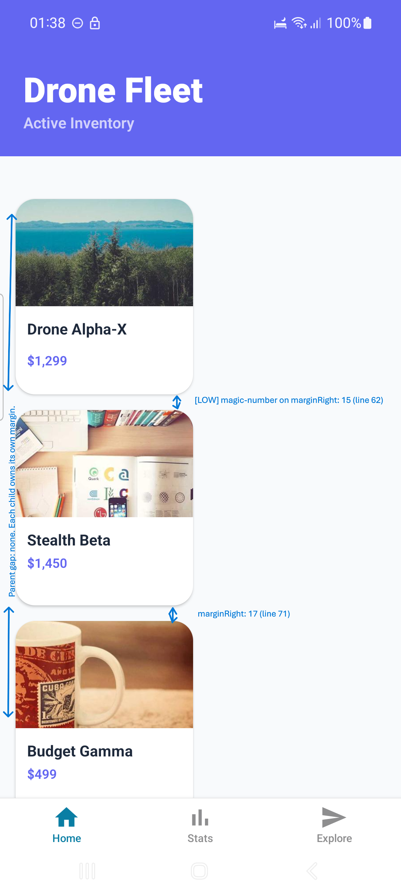
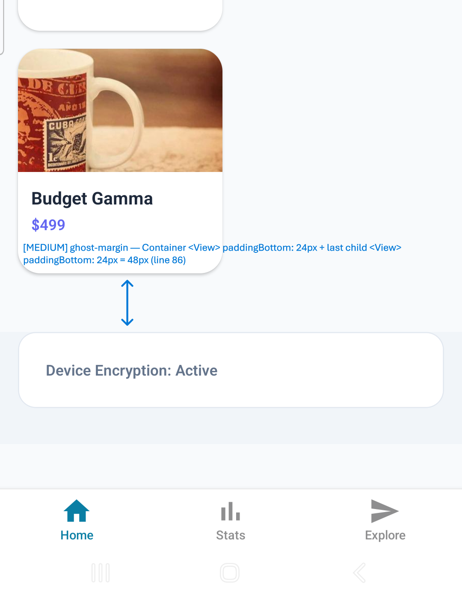
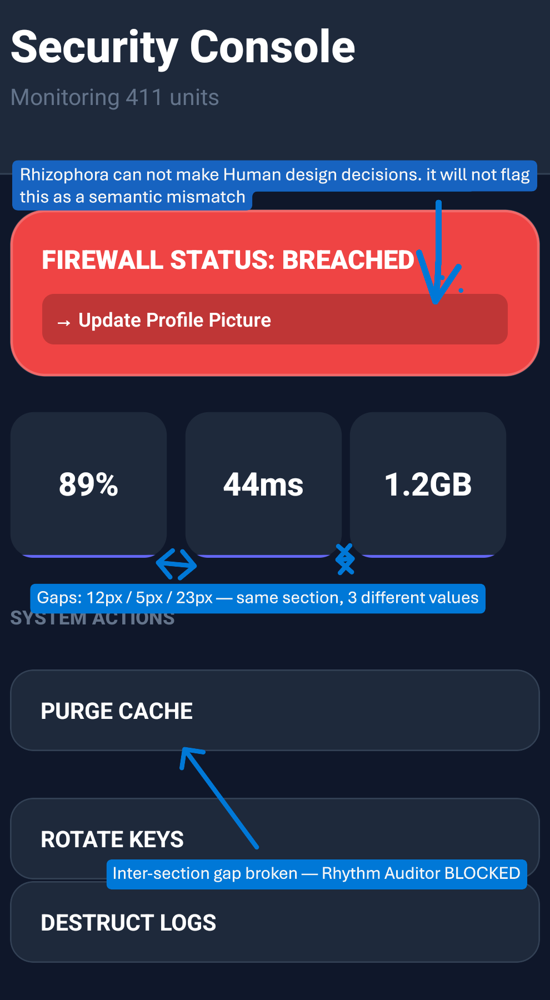

# Rhizophora Benchmark Report: The "Premium Chaos" Audit

This report documents the deterministic failure patterns embedded in the `rhizophora-testbed` project. It demonstrates the ability of the Rhizophora MCP to detect architectural rot that is visually undetectable but structurally dangerous.

---

## 1. Home Screen: The Spacing Minefield (`index.tsx`)




### 🛠️ Execution Command
`rhz detect_boundary_gaps --filePath app/(tabs)/index.tsx`

### 🚩 Critical Issue: Asymmetric Margin Pollution & Ghost Walls
The Home screen uses a 1px/17px margin drift between siblings. To a human eye, the grid looks perfectly aligned. To the auditor, it represents a breakdown in the 8px design system.

#### 📡 Rhizophora Signal (Real Audit Output)
```text
[HIGH] style-pollution | Container "ScrollView" (line 10) has 3 children using margins instead of parent gap.
[HIGH] style-pollution | Container "View" (line 21) has 3 children using margins instead of parent gap.
[MEDIUM] margin-stacking | Parent <View> padding + child <TouchableOpacity> margin = 32px. Likely unintended double spacing.
[LOW] magic-number | Spacing value 15 in "TouchableOpacity.marginRight" is not a design token.
[LOW] magic-number | Spacing value 17 in "TouchableOpacity.marginRight" is not a design token.
[LOW] magic-number | Spacing value 7 in "TouchableOpacity.marginTop" is not a design token.
[LOW] magic-number | Spacing value 21 in "View.marginBottom" is not a design token.
[SUMMARY] Health score: 20/100 — 5 critical, 11 warning(s), 16 info.
```

#### 🔍 Deep Find: Hidden Ghost Margins Inside Nested Children
This is the most dangerous finding — Rhizophora traced ghost margins **through nested component boundaries**, surfacing invisible spacing collisions no human QA would catch from a visual inspection.

```text
[MEDIUM] ghost-margin | Ghost Margin: Container <ScrollView> has paddingBottom: 40px and its last
  child <View> also has paddingBottom: 24px.
  Combined bottom spacing = 64px — likely unintended double padding.

[MEDIUM] ghost-margin | Ghost Margin: Container <View> has paddingBottom: 24px and its last
  child <View> also has paddingBottom: 24px.
  Combined bottom spacing = 48px — likely unintended double padding.

[MEDIUM] ghost-margin | Terminal Padding: Last child <TouchableOpacity> of container <View>
  has marginBottom: 16px but the container already has spacing.
  Creates redundant "Ghost Margin" boundary spacing.
```

#### 💻 The Culprit Code
```tsx
// Asymmetric sibling margins — visually identical, architecturally broken
<TouchableOpacity style={[styles.productCard, { marginRight: 16 }]}>...</TouchableOpacity>
<TouchableOpacity style={[styles.productCard, { marginRight: 15 }]}>...</TouchableOpacity>
<TouchableOpacity style={[styles.productCard, { marginRight: 17 }]}>...</TouchableOpacity>

// Ghost Wall cascade: ScrollView (40px) → child View (24px) = 64px invisible gap
<ScrollView contentContainerStyle={{ paddingBottom: 40 }}>
  <View style={{ paddingBottom: 24 }}>          {/* Hidden collision */}
    <TouchableOpacity style={{ marginBottom: 16 }}>  {/* Terminal ghost */}
      ...
    </TouchableOpacity>
  </View>
</ScrollView>
```

#### 🔄 The Rhizophora Remediation Path
Rhizophora enforces a strict "Order of Operations" for this screen:
1. **Foundation Fix**: Run `detect_boundary_gaps` to flag the off-token margins (`15px`, `17px`) and the ghost wall cascade (`ScrollView paddingBottom: 40 + child paddingBottom: 24 = 64px unintended gap`).
2. **Token Alignment**: Replace all child margins with a parent `gap: 16` to collapse the drift into a single source of truth.
3. **Rhythm Check**: Run `audit_spacing_rhythm` to confirm the boundary rule (zero `marginBottom` on last child) is satisfied.

---

## 2. Dashboard: Performance & Semantic Chaos (`dashboard.tsx`)



### 🛠️ Execution Command
`rhz detect_bridge_crossings --filePath app/(tabs)/dashboard.tsx`
`rhz audit_semantic_proximity --filePath app/(tabs)/dashboard.tsx`

### 🚩 Critical Issue: UI-Thread Bridge Crossing
The dashboard calculates its own width using a standard React `useState` inside an `onLayout` handler. This causes a "Bridge Crossing" that blocks the UI thread during every layout pass.

### 🚩 Critical Issue: Potential Sibling Blocking (Layout Pollution)
The metric cards look like siblings, but because they use hardcoded margins, the semantic auditor **refuses to suggest optimizations**.

#### 📡 Rhizophora Signal
```text
[HIGH] onLayout → setWidth (line 12)
  Context: (e) => setWidth(e.nativeEvent.layout.width)
[BLOCKED] Layout Pollution: Cannot suggest semantic grouping... siblings are using hardcoded margins.
```

#### 💻 The Culprit Code
```tsx
// app/(tabs)/dashboard.tsx
const [width, setWidth] = useState(0);

// Inconsistent hardcoded margins pollute the layout
<TouchableOpacity style={[styles.metricCard, { marginRight: 12 }]}>...</TouchableOpacity>
<TouchableOpacity style={[styles.metricCard, { marginRight: 5 }]}>...</TouchableOpacity>
```

#### 🔄 The Rhizophora Remediation Path
Rhizophora enforces a strict "Order of Operations" for this screen:
1. **Foundation Fix**: Run `detect_boundary_gaps` to identify and remove the hardcoded margins (`12px`, `5px`, `23px`).
2. **Semantic Realignment**: Once the margins are gone, re-run `audit_semantic_proximity` to group the metric cards into a logical section based on their 7/10 Proximity Score.
3. **Rhythm Application**: Run `audit_spacing_rhythm` to apply the correct 8px/16px hierarchy (Intra-section vs Inter-section gaps).

---

## 3. Explore: Structural & Performance Debt (`explore.tsx`)

### 🛠️ Execution Command
`rhz detect_nested_lists --filePath app/(tabs)/explore.tsx`
`rhz render_structural_diagram --filePath app/(tabs)/explore.tsx`

### 🚩 Critical Issue: Triple Nesting & Split Siblings
The Explore screen uses three levels of nested `.map()` calls, creating exponential render complexity. Additionally, it uses the "Illusion of Siblinghood" pattern where cards are visually grouped but architecturally isolated.

#### 📡 Rhizophora Signal
```text
[NESTED-LISTS] Found 4 nested list(s).
  <View> (line 25) contains <ScrollView> (line 27) — nested list.
[STRUCTURAL-DIAGRAM]
  ├── <View> (splitParent)
  │  ├── <View> (cardIsolationWrapper)
  │  │  ├── <TouchableOpacity>
  │  ├── <View> (cardIsolationWrapper)
  │  │  ├── <TouchableOpacity>
```

#### 💻 The Culprit Code
```tsx
// app/(tabs)/explore.tsx
{CATEGORIES.map((cat) => (
  <View key={cat.id}>
    <ScrollView horizontal>
      {cat.sub.map((sub) => (
        <View key={sub.id}>
          {['v1', 'beta'].map((tag) => ( // 3rd Level Nesting
             <View key={tag}><Text>{tag}</Text></View>
          ))}
        </View>
      ))}
    </ScrollView>
  </View>
))}
```

#### 🔄 The Rhizophora Remediation Path
Rhizophora enforces a strict "Order of Operations" for this screen:
1. **Structural Flatten**: Use `render_structural_diagram` to expose the unnecessary `cardIsolationWrapper` containers trapping the sibling cards.
2. **Promotion to Peers**: Remove the isolation wrappers so both `<TouchableOpacity>` cards become direct children of `splitParent`, enabling `gap`-based spacing.
3. **List Refactor**: Flatten the triple-nested `.map()` into a single flat data structure with `SectionList` to eliminate the nested scroll context.
4. **Rhythm Validation**: Run `audit_spacing_rhythm` to confirm a consistent gap between the now-true siblings and the surrounding sections.

---

## 🏁 Summary of Benchmark Value
This testbed proves that **visual correctness != architectural health**. By deterministic seeding of these "hard to find" issues, we can now validate that any future updates to the Rhizophora MCP maintain 100% sensitivity to high-fidelity layout rot.

Or just let an AI coding assistant call the Rhizophora MCP tools directly. The structured output is clear enough that the AI understands which tool to invoke next and can fix the issue without manual intervention.
